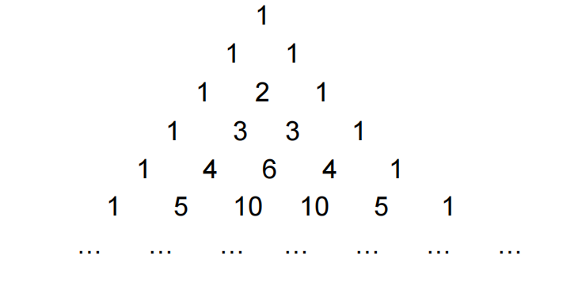
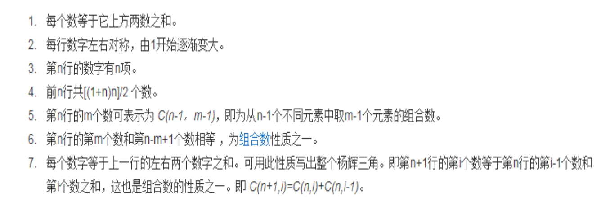
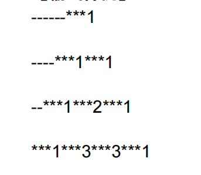

<font face="楷体" size=4>

#### $Tutorial$

## 计算机科学与工程学院$2023$级$C$语言期末

$HONG-LOU$ <t> </t> $2024-1-14$

#####   $ICPC$集训队 宁智伟

<br>

### $1.$ 时间换算 （分值：$10.00$）
【问题描述】将$d$天$h$小时$m$分钟换算成分钟，输入$d、h、m$，输出换算结果。
【输入形式】输入天、小时、分钟三个数，以空格分隔
【输出形式】输出换算好的分钟数
【样例输入】7 4 10
【样例输出】10330

#### 思路： 本题是$C$语言简单运算题，将天数和小时数转换为分钟再和分钟数相加即可得到答案.

#### $Code$:
```C
/**
 *    author:  HONG-LOU
 *    created: 2024-01-14 13:55:12
**/
#include <stdio.h>

int main () {
  int d, h, m;
  scanf("%d %d %d", &d, &h, &m);
  
  int sum = (d * 24 * 60) + (h * 60) + m;
  printf("%d", sum);
  return 0;
}
```

### $2.$ 数位数 （分值：$10.00$）
【问题描述】小明的表弟刚学会数数，给他一串数字让小表弟去数有多少位，
小表弟总是数错。 现要你通过编程帮小表弟计算给定的一个非负整数的位数。
【输入格式】
在一行中输入一个非负整数m， $0<=m<=900000000$。
【输出格式】
在一行中输出非负整数m的位数。
【输入样例】
10
【输出样例】
2

#### 思路：计算一个非负整数的位数，本题有两种解决方法，一种是利用$while$循环中不断减少一位直至$0$位，减少多少位得到的就是答案，另一种方法是使用字符串输入，直接使用$strlen$得到答案（非负整数）.

#### $code:$
```C
#include <stdio.h>

int main () {
  int x;
  scanf("%d", &x);

  int ans = 0;

  while (x > 0) {
    ans++;
    x = x / 10;
  }

  printf("%d", ans);
  return 0;
}
```

```C
#include <stdio.h>
#include <string.h>

char s[101];

int main () {
  scanf("%s", s);
  printf("%d", strlen(s));
  return 0;
}
```

### $3.$ 统计个数 （分值：$10.00$）
【问题描述】计算$[n,m]$范围内的所有正整数的各位上的数字之和，并统计各位数字之和满足可以被
4整除的个数。
【输入形式】输入正整数n,m，表示计算范围
【输出形式】输出满足条件的数的个数
【样例输入】
5 15
【样例输出】
2

#### 思路：考察循环结构，在$n-m$的范围内循环，将其中的每一位都复制出来单独求数位和，这样就不会影响循环中的数。

#### $code:$
```C
#include <stdio.h>

int main () {
  int n, m;
  scanf("%d %d", &n, &m);

  int ans = 0;

  int i;

  for (i = n; i <= m; i++) {
    int sum = 0;
    int cnt = i;

    while (cnt) {
      sum += cnt % 10;
      cnt /= 10;
    }
    
    if (sum % 4 == 0) {
      ans++;
    }
  }

  printf("%d", ans);
  return 0;
}
```

### $4.$求杨辉三角形 （分值：$10.00$）
【问题描述】
在屏幕上显示如下杨辉三角形：




【输入形式】
从键盘输入整数n（$n>=0$且$n<=12$）
【输出形式】
在屏幕上输出$n+1$行杨辉三角形。

【输入样例】
3
【输出样例】

其中－和*都是空格位
即每个数字占四位！
【提示】
可以用二维数组中的非零元素来表示三角形的值。根据杨辉三角形的规律，从数组的第0行起，逐行
对不同元素进行赋值或者计算。输出时，如果元素是0，则输出空格；如果是非0，则输出元素值本
身。

#### 思路:主要考察杨辉三角值的递推以及输出形式，数组中从第二行开始每一项$a[i][j] = a[i - 1] [j] + a[i - 1][j - 1]$, 即是上方两数之和，特别注意的是输出的时候每一行前面的空格个数。

#### $code:$
```C
#include <stdio.h>

int c[15][15] = {0};

int main () {
  c[1][1] = 1;
  int i, j;

  for (i = 2; i < 15; i++) {
    for (j = 1; j <= i; j++) {
      c[i][j] = c[i - 1][j] + c[i - 1][j - 1];
    }
  }

  int n;
  scanf("%d", &n);

  for (i = 1; i <= n + 1; i++) {
    for (j = 0; j < n - i + 1; j++) {
      printf("  ");
    }

    for (j = 1; j <= i; j++) {
      printf("%4d", c[i][j]);
    }
    printf("\n");
  }

  return 0;
}
```

### 5. 字符串逆序输出 （分值：$10.00$）
【问题描述】字符串逆序：设计函数功能是将一个字符串逆序，函数声明：void stringNx(char *a)
使用这个函数完成将输入的字符串逆序输出
【输入形式】要求输入一个字符串
【输出形式】逆序后输出
【样例输入】abcd
【样例输出】dcba

#### 思路：将字符串传给函数，新建一个新字符数组存放逆序后的字符串，否则可能对原字符串造成破坏，新的字符数组与原来字符串的对应关系是第一位对最后一位，最后一位对第一位，（设新字符数组为cnt, a长度为len）即$[i ~ : ~ 0 \rightarrow len - 1] \Rightarrow cnt[i] = a[len - i - 1]$.

#### $ code:$
```C
#include <stdio.h>
#include <string.h>

char s[10101];

void stringNx (char *a) {
  char cnt[10101];
  int len = strlen(a);
  int i;
  for (i = 0; i < len; i++) {
    cnt[i] = a[len - i - 1];
  }
  strcpy(a, cnt);
}

int main () {
  scanf("%s", s);

  stringNx(s);
  printf("%s", s);
  return 0;
}
```

### $6.$ 比较两组整数 （分值：$10.00$）
【问题描述】
比较两组整数是否有相同的元素，不考虑元素的顺序，并忽略元素重复的情况，每组元素个数不超
过100。例如：
2 5 10 17 10 8 5 10 12
与下列一组整数：
12 8 10 17 5 2
相同。
【输入形式】
首先输入第一组整数的个数，再输入第一组整数，以空格分割；然后输入第二组整数的个数，再
输入第二组整数，以空格分割。
【输出形式】
打印两组整数中同时出现的元素，顺序以第一组的整数输入顺序为准。如果两组整数中没有相同
元素，则打印No Answer
【输入样例】
9
2 5 10 17 10 8 5 10 12
6
12 8 10 17 5 2
【输出样例】
2 5 10 17 8 12
【样例说明】
输入两组整数
2 5 10 17 10 8 5 10 12
12 8 10 17 5 2
打印两个数组中同时出现的元素，打印顺序按元素在第一行中出现的顺序。

#### 思路：本题有两种思路，第一种是将两个数组中的元素循环比较，有相同元素时存在一个新的数组，最后将新数组中的元素每个与它之前的相比较，若无相同则输出，否则跳过，起到去重作用。第二种方法是若题目给出数组范围比较小是，可建立一个数组，其中 $a[i]$ 代表 $i$ 这个数出现的次数，若 $i$ 在题目给出两个数组中都有出现，则将该位标记，组后按给出的第一个数组的顺序输出即可。

#### $code：$
```C
#include <stdio.h>

int a[110], b[110];

int c[1010];

int main () {
  int n, m;
  scanf("%d", &n);

  int i;
  for (i = 0; i < n; i++) {
    scanf("%d", &a[i]);
  }

  scanf("%d", &m);
  for (i = 0; i < m; i++) {
    scanf("%d", &b[i]);
  }

  int j;

  int num = 0;
  for (i = 0; i < n; i++) {
    for (j = 0; j < m; j++) {
      if (a[i] == b[j]) {
        c[num] = a[i];
        num++;
        break;
      }
    }
  }

  for (i = 0; i < num; i++) {
    printf("%d ", c[i]);
  }
  printf("\n");

  for (i = 0; i < num; i++) {
    int isexited = 0;
    for (j = 0; j < i; j++) {
      if (c[j] == c[i]) {
        isexited = 1;
        break;
      }
    }
    if (!isexited) {
      printf("%d ", a[i]);
    }
  }

  return 0;
}
```

```C
#include <stdio.h>

int a[1010], b[1010], c[1010101];

int main () {
  int n, m;
  scanf("%d", &n);
  int i;
  for (i = 0; i < n; i++) {
    scanf("%d", &a[i]);
    c[a[i]] = 1;
  }
  scanf("%d", &m);
  for (i = 0; i < m; i++) {
    scanf("%d", &b[i]);

    if (c[b[i]]) {
      c[b[i]] = 2;
    }
  }

  for (i = 0; i < n; i++) {
    if (c[a[i]] == 2) {
      printf("%d ", a[i]);
      c[a[i]] = 3;
    }
  }

  return 0;
}
```

### $7.$ 二维整型数组的“最大点” （分值：$10.00$）
【问题描述】
求二维整型数组的最大点。二维数组的“最大点”定义为：某个数是所在行的最大值，并且是所在
列的最大值。注意：某行或某列上可能有多个最大点。
【输入形式】
从控制台（标准输入）读入二维数组。
第一行只有以空格分隔的两个正整数n和m（n,m<=10），n代表二维数组的行数，m代表二维数
组的列数。
然后在后续n行上输入二维数组的元素，每行有m个以若干空格分隔的整数，代表二维数组在该行
上的所有元素。
【输出形式】
向控制台输出二维数组的最大点，按行下标、列下标从小到大的顺序输出，每行一个，先输出最
大点数值，再输出对应的行数、列数（行列都从1开始计数），以一个空格分隔。
【样例输入】
3 4
8 60 7 100
10 498 12 49
-71 132 4 85
【样例输出】
100 1 4
498 2 2
【样例说明】
输入了一个三行四列的二维数组，第一行第四列的元素100是第一行的最大元素，同时也是第四列
的最大元素，所以该元素是最大点，输出100 1 4。同样第二行第二列的元素498也是第二行的最大
元素，同时是第二列的最大元素，故该元素也是最大点，输出498 2 2。
【评分标准】
要求输出二维数组的所有最大点。
【提示】
一种求解策略是：自上而下扫描二维数组的每一行：
（1）找到这一行中的最大数x
（2）再检测该数x是否是是所在列上的最大数。若是，则该数就是最大点，需要输出该数本身、所
在的行号和列号（注意：输出的是自然行、列序号，不是数组中的行、列序号）

#### 思路：先将输入存放在二维数组中，同样是两种方法，第一种是按照题目提示，在二维数组循环遍历的过程中，判断当前位置的数是否是当前行最大数且是当前列最大数，如果是，就输出题目要求信息。第二种方法是把每一行每一列中最大的数存放在两个数组中，将二维数组便利，若 $a_{ij} == rmax_i \And\And a_{ij} == cmax_j$，则输出当前位置信息。

#### $code:$
```C
#include <stdio.h>

int a[15][15];

int main () {
  int n, m;
  scanf("%d %d", &n, &m);

  int i, j;
  for (i = 0; i < n; i++) {
    for (j = 0; j < m; j++) {
      scanf("%d", &a[i][j]);
    }
  }

  for (i = 0; i < n; i++) {
    for (j = 0; j < m; j++) {
      int ismax = 1;
      int k;
      for (k = 0; k < n; k++) {
        if (a[k][j] > a[i][j]) {
          ismax = 0;
        }
      }
      for (k = 0; k < m; k++) {
        if (a[i][k] > a[i][j]) {
          ismax = 0;
        }
      }
      if (ismax) {
        printf("%d %d %d\n", a[i][j], i + 1, j + 1);
      }
    }
  }

  return 0;
}
```

```C
#include <stdio.h>

int rmax[1010] = {0}, cmax[1010] = {0};

int a[1010][1010];

int max(int a, int b) {
  return a > b ? a : b;
}

int main () {
  int n, m;
  scanf("%d %d", &n, &m);
  int i, j;

  for (i = 0; i < n; i++) {
    for (j = 0; j < m; j++) {
      scanf("%d", &a[i][j]);
      rmax[i] = a[i][j];
      cmax[j] = a[i][j];
    }
  }

  for (i = 0; i < n; i++) {
    for (j = 0; j < m; j++) {
      rmax[i] = max(a[i][j], rmax[i]);
      cmax[j] = max(a[i][j], cmax[j]);
    }
  }

  for (i = 0; i < n; i++) {
    for (j = 0; j < m; j++) {
      if (a[i][j] == rmax[i] && a[i][j] == cmax[j]) {
        printf("%d %d %d\n", a[i][j], i + 1, j + 1);
      }
    }
  }

  return 0;
}
```

### $8.$ 从文本文件中读入学生信息，按要求排序后输出 （分值：$15.00$）
【题目描述】
某班开设有英语、数学、程序设计三门课程，该班同学信息保存在文本文件student.txt中。
编写程序，从文件读入该班同学信息，然后分别按总成绩和英语成绩从高分到低分排序。该班同学
不多于50人。
【输入形式】
文本文件student.txt，每行数据描述一个同学信息，包括名字、英语、数学、程序设计成绩。假设
该文件和程序处于同一文件夹或目录中。
【输出形式】
该班同学总成绩排序和英语成绩排序，成绩相同时按输入次序。 每行输出中每一项占12位（一个汉
字将占2位）。
【程序要求】
（1）在程序中声明一个结构体类型struct student，并为该类型定义一个别名STU。
（2）按所有学生按总成绩排序、按英语成绩排序、学生信息输出的功能，分别用函数来实现。三个
函数的原型分别为：
 void SortByTotal(STU *stu, int n);
 void SortByEnglish(STU *stu, int n);
 void Output(STU stu[], int n);
注意：若没有实现以上要求，即使输出结果正确，也将扣分。
【样例输入】
文本文件student.txt，内容格式如下
张三 80 90 88
李四 66 80 90
王五 50 78 87
Jack 68 86 70
Tom 60 88 96
【样例输出】
 Name English Math C Total
张三 80 90 88 258
Tom 60 88 96 244
李四 66 80 90 236
 Jack 68 86 70 224
王五 50 78 87 215
 Name English Math C Total
张三 80 90 88 258
 Jack 68 86 70 224
李四 66 80 90 236
Tom 60 88 96 244
王五 50 78 87 215

#### 思路：先建立结构体，然后将输入存放在建立好的结构体数组中，然后依次实现题目所要求的函数，排序时使用冒泡排序，需要注意的是文件的读入还有输出格式的问题。

#### $code:$
```C
#include <windows.h>
#include <stdio.h>
#include <string.h>

typedef struct student {
  char name[20];
  int e;
  int m;
  int c;
  int total;
} STU;

STU s[1010];

void SortByTotal (STU *stu, int n);

void SortByEnglish (STU *stu, int n);

void Output (STU stu[], int n);

char h[5][12] = {"Name", "English", "Math", "C", "Total"};

int main () {
  freopen("student.txt", "r", stdin);

  int num = 0;

  while (scanf("%s %d %d %d", s[num].name, &s[num].e, &s[num].m, &s[num].c) != EOF) {
    s[num].total = s[num].e + s[num].m + s[num].c;
    num++;
  }


  fclose(stdin);

  int i;

  SetConsoleOutputCP(65001);

  Output(s, num);

  SortByTotal(s, num);

  Output(s, num);

  SortByEnglish(s, num);

  Output(s, num);

  return 0;
}

void SortByTotal (STU *stu, int n) {
  int i, j;
  for (i = 0; i < n; i++) {
    for (j = i + 1; j < n; j++) {
      if (stu[j].total > stu[i].total) {
        STU cnt;
        strcpy(cnt.name, s[j].name);
        cnt.total = stu[j].total;
        cnt.e = stu[j].e;
        cnt.m = stu[j].m;
        cnt.c = stu[j].c;
        stu[j] = stu[i];
        stu[i] = cnt;
      }
    }
  }
}

void SortByEnglish (STU *stu, int n) {
  int i, j;
  for (i = 0; i < n; i++) {
    for (j = i + 1; j < n; j++) {
      if (stu[j].e > stu[i].e) {
        STU cnt;
        strcpy(cnt.name, s[j].name);
        cnt.total = stu[j].total;
        cnt.e = stu[j].e;
        cnt.m = stu[j].m;
        cnt.c = stu[j].c;
        stu[j] = stu[i];
        stu[i] = cnt;
      }
    }
  }
}

void Output (STU stu[], int n) {
  int i;
  for (i = 0; i < 5; i++) {
    printf("%-12s", h[i]);
  }
  printf("\n");

  for (i = 0; i < n; i++) {
    int j;
    int zh = 0;
    for (j = 0; j < strlen(stu[i].name); j++) {
      if (!isalpha(stu[i].name[j])) {
        zh += 1;
      }
    }
    zh /= 3;
    printf ("%s", stu[i].name);
    int len = strlen(stu[i].name);
    if (!isalpha(stu[i].name[0])) {
      len /= 3;
    }
    for (j = 0; j < 12 - len - zh; j++) {
      printf(" ");
    }

    printf("%-12d%-12d%-12d%-12d\n", stu[i].e, stu[i].m, stu[i].c, stu[i].total);
  }
}
```

### $9.$ 单词索引编排 （分值：$15.00$）
【问题描述】
打开一英文文章（保存在一个现有文件in.txt中），为该文件生成词汇表（存到另一个文件out.txt
中）。要求词汇表中的单词以字典序由小到大存放（只由连续字母组成，且全为小写字母，不重
复）。
假设：
1、该文章有可能没有经过排版，格式有可能杂乱无章。
2、文章中的单词个数不超过1000个，每个单词的长度不超过50个字母。
【输入形式】
保存英文文章的文件in.txt位于当前目录下。
【输出形式】
将生成的词汇表以字典序由小到大输出到当前目录下的文件out.txt中，每个单词单独占一行。
【样例输入1】
假设文件in.txt内容为：
There are two versions of the international standards for C.
The first version was ratified in 1989 by the American National
Standards Institue (ANSI) C standard committee.It is often
referred as ANSI C or C89. The secand C standard was completed
in 1999. This standard is commonly referred to as C99. C99 is a
milestone in C's evolution into a viable programming language
for numerical and scientific computing.
【样例输出1】
文件out.txt中的词汇表应为：
a
american
and
ansi
are
as
by
c
committee
commonly
completed
computing
evolution
first
for
in
institue
international
into
is
it
language
milestone
national
numerical
of
often
or
programming
ratified
referred
s
scientific
secand
standard
standards
the
there
this
to
two
version
versions
viable
was
【样例输入2】
假设文件in.txt内容为：
There are two versions of the international standards for
【样例输出2】
文件out.txt中的词汇表应为：
are
for
international
of
standards
the
there
two
versions
【样例说明】
将in.txt中出现的所有由字母组成的单词（出现的单个字母也作为单词）全部转换成小写后，按照字
典序输出到文件out.txt中（每个单词独占一行，重复出现的只输出一次）。

#### 思路：将文本使用 $scanf$ 返回值不为 $EOF ~ (END ~ OF ~  FILE)$ 的方式读入进来，对每一段字母进行分割、转小写、去掉不相关字符操作，再使用冒牌排序，对字符串数组进行排序，循环判断去重，得到最后的结果。

#### $code:$
```C
#include <stdio.h>
#include <string.h>

char s[1010][60];

int main () {
  freopen("in.txt", "r", stdin);

  int num = 0;
  while (scanf("%s", s[num]) != EOF) {
    num++;
  }

  int i, j;

  fclose(stdin);

  for (i = 0; i < num; i++) {
    int len = strlen(s[i]);
    int dev = 0;

    char l[60], r[60];
    int has = 0;
    for (j = 1; j < len - 1; j++) {
      if (s[i][j] == '\'') {
        has = 1;
        int k;
        for (k = 0; k < j; k++) {
          l[k] = s[i][k];
        }
        for (k = j + 1; k < len; k++) {
          r[k - j - 1] = s[i][k];
        }
      }
    }
    if (has) {
      strcpy(s[i], l);
      strcpy(s[num], r);
      num++;
    }
  }

  for (i = 0; i < num; i++) {
    char cnt[60] = "";
    int length = 0;
    for (j = 0; j < strlen(s[i]); j++) {
      if (s[i][j] >= 'A' && s[i][j] <= 'Z') {
        s[i][j] += ('a' - 'A');
      }
      if (s[i][j] > 'z' || s[i][j] < 'a') {
        continue;
      }
      cnt[length] = s[i][j];
      length += 1;
    }
    strcpy(s[i], cnt);
  }

  for (i = 0; i < num; i++) {
    for (j = i + 1; j < num; j++) {
      if (strcmp(s[i], s[j]) == 1) {
        char cnt[60] = "";
        strcpy(cnt, s[j]);
        strcpy(s[j], s[i]);
        strcpy(s[i], cnt);
      }
    }
  }

  for (i = 0; i < num; i++) {
    int has = 0;
    for (j = 0; j < i; j++) {
      if (strcmp(s[j], s[i]) == 0) {
        has = 1;
        continue;
      }
    }
    if (has == 0) printf("%s\n", s[i]);
  }

  return 0;
}
```

#### 广告 ： $2023$级集训队$QQ$群：$758412681$