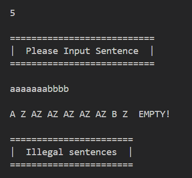

### $1.Grammar To FA $
### $2.Determine NFA or DFA$
### $3.NFA To DFA$
### $4.Minimize DFA$
### $5.Run Min-DFA Model$

 
 

### 运行方式

$Windows$环境下，配置$g++$编译器，版本$g++ (GCC) 12.2.0$
$WORKDIR$ $fa$下，运行$run.bat$ 完成编译和打开运行

### 测试样例
输入过程为：

$1$
$gra.in$

$2$

$3$

$4$

$5$
$aaaaaaabbbb$

$5$
$abababab$

#### $1.Grammar ~ ~ To ~ ~ FA $

 

$NFA$ 和 $DFA$ 结构体，即为五元组存储方式.

 

输入文件名指定正则文法读取路径，使用$c++$容器实例 $std::vector<std::vector<std::array<char, 2>>>$ 存储正则文法，存储方式为带权有向图。

#### $2.Determine ~ ~ NFA ~ ~ or ~ ~ DFA$

 

自定义 $print$ 函数输出图关键信息，并将图传给$mysql$式表格输出函数，判断是否$DFA$方式为如果穿的值里有一列长度不为一，既有多个选择时，即为$NFA$。

#### DFA Output

实现表格的格式化输出，借鉴$mysql$命令行数据库输出格式完成。

 

实现 $Print-DFA$ 函数，作用为格式化输出DFA。

#### $3.NFA ~ ~ To ~ ~ DFA$

实现 $sol $函数，实现$NFA$ 到 $DFA$ 的转换，具体办法为不断将新的状态添加到队列末尾，直至无新状态的产生，即为$DFA$ ，返回值为 $DFA$ 五元组。

#### $4.Minimize ~ ~ DFA$

$min$ 函数，实现$DFA$的最小化，具体方法为将属性集合不断拆分为不可再分，再将相同状态的集合校区，即得到最小化的$DFA$。

#### $5.Run Min-DFA Model$

$run$ 函数，实现句子在$DFA$上的运行，判断是否可以产生这个句子，并返回真值。